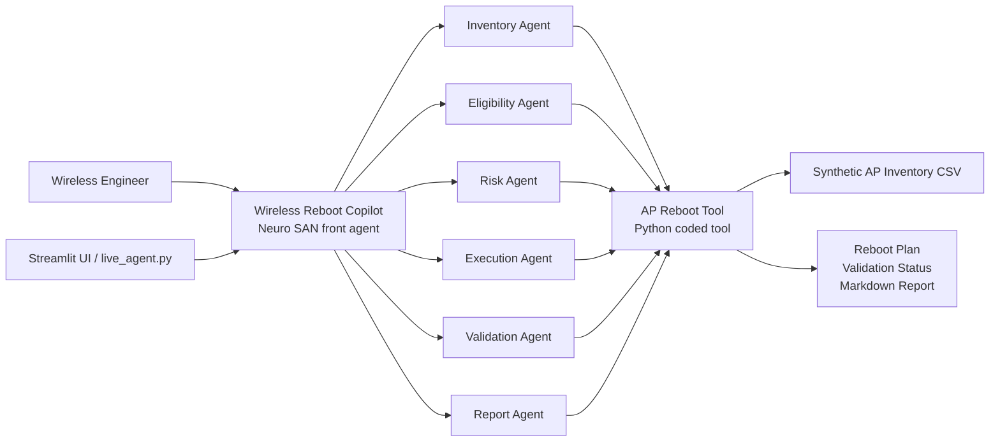

# Architecture

## Project Goal

GNS Zero-Client Reboot Orchestrator is a Neuro SAN based multi-agent workflow for safe wireless AP reboot operations. It helps a wireless operations engineer identify access points with high uptime, confirm they have zero active clients, check operational risk, execute or simulate reboot actions, validate recovery, and generate a final report.

The project wraps an existing AP reboot automation tool with an agentic orchestration layer. The Python tool handles deterministic device logic, while the Neuro SAN agents handle task decomposition, explanation, decision flow, and report generation. The repository includes both a standalone dry-run path and a live Neuro SAN direct-agent path backed by NVIDIA/NVAPI.

## High-Level Architecture

## Agent Roles

| Agent | Responsibility | Why It Helps Evaluation |
|---|---|---|
| Wireless Reboot Copilot | Front agent that receives the user request, coordinates specialist agents, and returns the final answer. | Shows a clear Neuro SAN agent network instead of a single script. |
| Inventory Agent | Reads AP inventory and groups APs by site tag, uptime, clients, reachability, and controller state. | Makes the workflow explainable from the start. |
| Eligibility Agent | Selects APs with uptime above threshold and zero clients. | Converts operational policy into repeatable logic. |
| Risk Agent | Blocks APs with active clients, unreachable status, non-joined state, critical site flag, or missing maintenance window. | Shows guardrails and responsible automation. |
| Execution Agent | Runs dry-run or approved reboot action in controlled batches. | Keeps the demo safe while showing production intent. |
| Validation Agent | Checks whether rebooted APs recover to joined and reachable state. | Demonstrates closed-loop automation, not only triggering action. |
| Report Agent | Produces a report with selected, skipped, rebooted, validated, and failed APs. | Creates an evaluator-friendly output artifact. |

## Data Flow

1. The user asks for AP reboot planning using the Streamlit UI, `backend/live_agent.py`, or the Neuro SAN client with a site tag and safety requirements.
2. The front agent delegates the request to the inventory agent.
3. The inventory agent calls the coded tool to load AP data.
4. The eligibility agent filters APs using uptime and zero-client rules.
5. The risk agent applies safety checks and explains blocked APs.
6. The execution agent performs a dry run by default, or an approved live action in a production version.
7. The validation agent confirms AP recovery state.
8. The report agent generates a final Markdown summary.

## Core Safety Rules

The project uses the following rules before allowing an AP into the reboot plan:

- AP uptime must be greater than or equal to the configured threshold, default `100` days.
- Active client count must be `0`.
- AP must be reachable.
- AP controller state must be `joined`.
- AP must be within the approved maintenance window.
- AP must not be marked as a critical site AP unless explicitly approved.
- Live mode must require explicit operator approval.

## Coded Tool Layer

The coded tool is responsible for deterministic logic:

- Loading AP inventory from CSV.
- Filtering candidates.
- Explaining blocked devices.
- Building a batch plan.
- Simulating or executing reboot actions.
- Validating recovery.
- Generating the final report.

This separation keeps the LLM agents focused on reasoning and coordination while the Python code handles predictable operational rules.

## Demo Data Policy

The submitted project uses synthetic AP names, synthetic site tags, and synthetic controller data. No client, customer, restricted, or production network material is required for the demo.

## Production Extension Path

For a real deployment, the coded tool can be extended to call approved wireless controller APIs. The agent workflow should remain the same, but the execution action would move from dry-run simulation to an authenticated API action protected by:

- Operator confirmation.
- Change ticket reference.
- Controller allowlist.
- Rate limit per site.
- Rollback or stop condition if validation fails.
